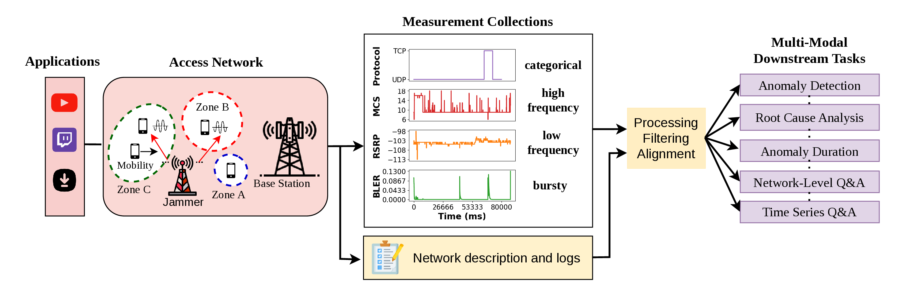

<p align="center"> 
  
</p>


<p align="center">
  <a href="https://icml.cc/Conferences/2026"></a>
  <a href="https://arxiv.org/abs/2510.06063"></a>
  <a href="https://huggingface.co/datasets/AliMaatouk/TelecomTS"></a>
  <a href="https://www.python.org/downloads/release/python-3110/"></a>
  
</p>


# TelecomTS: A Multi-Modal Telecom Dataset

## Overview


**TelecomTS** is a large-scale, high-resolution, multi-modal dataset derived from a **5G telecommunications testbed**. It is the first public observability dataset to preserve **de-anonymized** observability metrics with **absolute scale information**, encompassing by design a broad suite of multi-modal downstream tasks:

- 🔎 **Anomaly detection** (binary)
- 🛠️ **Root-cause analysis** (multi-class)
- ⏱️ **Anomaly duration localization** (sequence labeling)
- 📈 **Forecasting / reconstruction** (multi-channel)
- 🤖 **Time series and network-level Q&A** (multi-modal reasoning)

Observability data, particularly in telecommunications, differs fundamentally from conventional time series (e.g., weather, finance) by being:

- **Zero-inflated**, with metrics dominated by zeros punctuated by informative spikes
- **Highly stochastic and bursty**, with frequent, abrupt transitions
- **Structurally noisy** with minimal discernible temporal patterns

## Dataset

### Key Features

- ~**32K** time series samples and **1M+** total observations from a 5G testbed
- **Multi-modal inputs**:
  - Time series KPIs across PHY, MAC, and network layers, sampled at **10 Hz** (100 ms)
  - Natural-language network descriptions and Q&A pairs
- **Heterogeneous covariates**: numeric KPIs and categorical fields (e.g., UL_Protocol, DL_Protocol)
- **Absolute scale preserved** (no normalization, no anonymization)
- **Real and synthetic anomalies**: 10 synthetic types grounded in telecom literature plus one real anomaly (jamming) collected over the air
- **Reasoning traces**: chain-of-thought traces for reasoning-aware fine-tuning and RL
- **Labels / metadata**: zone, application, mobility, congestion state, anomaly presence

### Sample Structure

Each sample in TelecomTS contains:

- **start_time / end_time** — temporal boundaries of the chunk
- **sampling_rate_hz** — number of timesteps per second 
- **description** — natural-language summary of the network environment and time series behaviors
- **KPIs** — key performance indicator names and values
- **anomalies** — existence, type, duration, affected KPIs, and troubleshooting tickets
- **statistics** — mean, variance, trend, and periodicity for each KPI
- **labels** — contextual metadata (zone, application, mobility, congestion, anomaly presence)
- **QnA** — natural-language Q&A over the sample, grouped into `timeseries`, `network`, and `anomalies` subcategories. Each entry of has the following structure:

  ```json
  { "q": "What activity was the user engaged in?",
    "a": "Twitch",
    "reasoning": "Sustained downlink throughput in the 2–4 Mbps range with periodic UDP bursts and stable RSRP is consistent with live video streaming..." }
  ```

  The `reasoning` field, present in the last two subcategories, contains an explicit reasoning trace that reveals the intermediate decision-making steps used to derive the final answer. 
  


### Statistics

| Statistic                | Description                  | Count                                      |
|:-------------------------|:-----------------------------|:-------------------------------------------|
| **Time Series Samples**  | Total samples                | 32,000                                     |
|                          | Sample length                | 128                                        |
| **Channels**             | Total channels               | 18                                         |
|                          | Channel types                | 10 float, 6 integer, 2 categorical         |
| **Anomalies**            | Anomaly types                | 11                                         |
| **Q&A Categories**       | Time Series Q&A categories   | 64                                         |
|                          | Network-Level Q&A categories | 5                                          |
|                          | Anomalies Q&A categories     | 3                                          |
| **Total QA Size**        | Total QA instances           | **2,210,216**                              |


### Loading the Dataset

TelecomTS is hosted on the Hugging Face Hub at [`AliMaatouk/TelecomTS`](https://huggingface.co/datasets/AliMaatouk/TelecomTS). You can load it directly with the 🤗 `datasets` library:

```python
from datasets import load_dataset

dataset = load_dataset(
    "AliMaatouk/TelecomTS",
    data_files={"full": "**/chunked.jsonl"},
)["full"]

print(dataset)            
```

The benchmarking pipeline in this repo fetches the data automatically — no manual download is required.

## Quickstart

> Requires **Python 3.11**

```bash
# 1) Clone
git clone https://github.com/Ali-maatouk/TelecomTS.git
cd TelecomTS_Benchmark

# 2) Create & activate a virtual environment
python3.11 -m venv .venv
# macOS/Linux:
source .venv/bin/activate
# Windows (PowerShell):
# .venv\Scripts\Activate.ps1

# 3) Install dependencies
python -m pip install --upgrade pip
pip install -r requirements.txt

# 4) Run (uses configs/config.yaml)
# The dataset is fetched automatically from the Hugging Face Hub
# (AliMaatouk/TelecomTS) on first run and cached locally.
# This trains the selected encoder on the chosen task and then evaluates it.
python3 src/run.py
```

## Supported Tasks & Models

Choose the **model** and the **task** in [`configs/config.yaml`](configs/config.yaml). Running `python3 src/run.py` **trains** the selected model and **evaluates** it on the chosen task.

- **Tasks** (`task_type`)
  - `anomaly detection`
  - `root-cause analysis`
  - `anomaly duration`
  - `forecasting`

- **Encoders** (`encoder_type`)
  - `TimesNet`
  - `Autoformer`
  - `NonStationary_Transformer`
  - `FEDformer`
  - `Informer`

## Citation

You can find the paper with all details at https://arxiv.org/abs/2510.06063. Please cite it as follows:

```bibtex
@misc{feng2025telecomtsmultimodalobservabilitydataset,
      title={TelecomTS: A Multi-Modal Observability Dataset for Time Series and Language Analysis},
      author={Austin Feng and Andreas Varvarigos and Ioannis Panitsas and Daniela Fernandez and Jinbiao Wei and Yuwei Guo and Jialin Chen and Ali Maatouk and Leandros Tassiulas and Rex Ying},
      year={2025},
      eprint={2510.06063},
      archivePrefix={arXiv},
      primaryClass={cs.AI},
      url={https://arxiv.org/abs/2510.06063},
}
```
